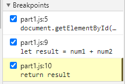
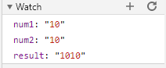
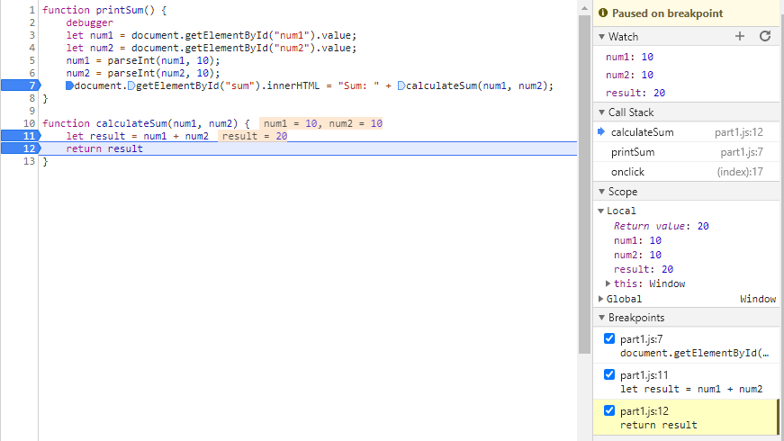

### What was the bug?
The bug was that num1 and num2 are being treated as strings. Therefore when they are summed using the + operator,
it acts as a concatenation operator instead of addition.

### How would you fix it?
I would fix it by calling parseInt() on num1 and num2 and saving that value in num1 and num2 respectively. This would
cause + to do addition.

## Network Tab

1. citylots.json
2. part2.js
3. 11.7 MB
4. 15.01 s
5. Mozilla/5.0 (Windows NT 10.0; Win64; x64) AppleWebKit/537.36 (KHTML, like Gecko) Chrome/87.0.4280.141 Safari/537.36
6. Apache
7. Tue, 26 Jan 2021 22:14:13 GMT
8. application/json
9. fetchData()
